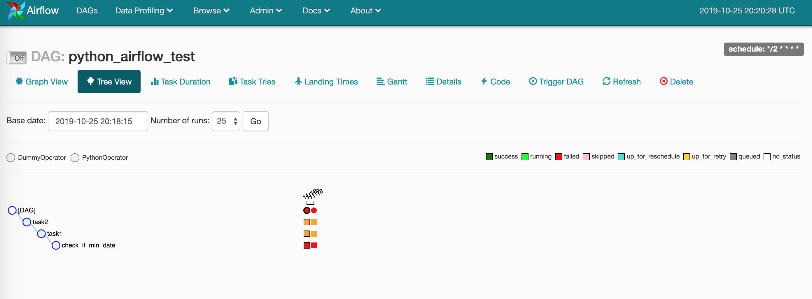
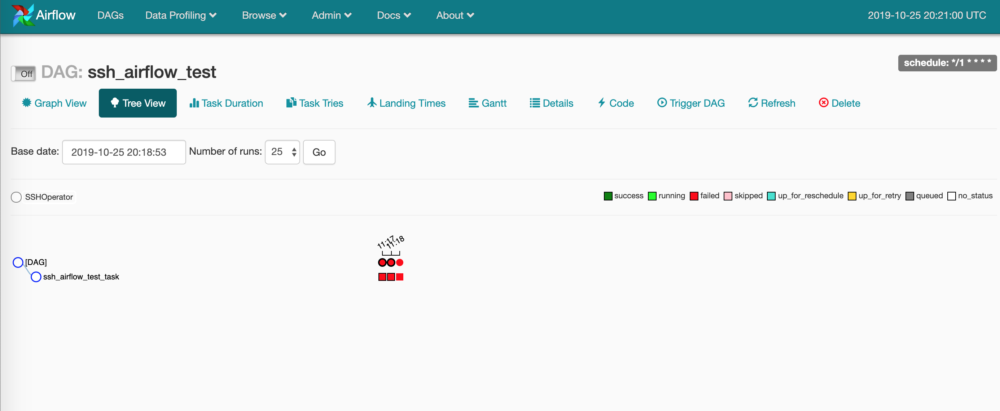

# Airflow - Mysql Workflow
[Airflow](https://airflow.apache.org/) iş akışlarınızı programatik olarak yönetebileceğiniz, görüntülebileceğiniz bir platformdur. Bu platfomun Mysql ile bağlantısını docker-compose ile kurarak servisin logları ve yönetiminin daha kolay yapılması ve hızlı bir servis sunumu amaçlanmıştır. Bu çalışmada docker ile servisin sunulması sunularak kolay kurulum ve yönetim amaçlanmaktadır.


### Servisin Kurulumu
Reponun çekilmesi
```
git clone https://github.com/zaferdurkut/airflow.git
```
Proje dizinine gidilmesi
```
cd airlow
```
Servislerin kurulumu ve başlatılması için aşağıdaki komut çalıştırılmalıdır. Buna ek olarak docker-compose.yml dosyası içerisinden çıkış portları için ayarlamalar yapılabilir. Airflow servisi için bir değişiklik yapılacak ise airflow/airflow.cfg dosyası içerisinde port ayarları bu port için yapılmalıdır.
```
docker-compose up -d --build
```
Servisler başlatıldıktan sonra airflow servisine giriş için
```
docker exec -it airflow_app_1 bash
```
Servise girdikten sonra bir seferlik airflow'u db ye initial etmek için aşağıdaki komut çalıştırılır.
```
airflow initdb
```
Initial işlemi tamamlandıktan sonra aiflow servisini başlatmak için aşağıdaki komutlar çalıştırılmalıdır.
```
airflow webserver
airflow scheduler
```
Yukarıda işlem yerine tek serviste iki airflow (webserver, scheduler) çalıştırabilmek için aşağıdaki komut çalıştırabilir. Configler'de bir değişim yapıldıysa supervisord.conf dosyası içerisinde yüncelleme yapılmadır. ve servis yeniden build edilmedir.
```
supervisord
```
Servise http://localhost:8080/ adresinden ulaşabilirsiniz.

Bu işlemi yaptıktan sonra Airflow servisi Mysql veritabanına bağlı olarak çalışabilecektir.





##### Ek Bilgiler
Airflow DB'si sıfırlanacak ise aşağıdaki komut çalıştırılabilir.
```
airflow resetdb
```
Servis logları dizi airflow/logs dizini altında olacaktır. Eğer volume verilmezse serviste şişme olabilir. Buna dikkat edilmelidir.

 DB verileri mevcut docker-compose yapısında .data klasörü altında olacaktır.

### Dag İşlemleri
Servis içerisinde yeni [DAG](https://airflow.apache.org/concepts.html) eklenecek ise airflow/dags dizini altına eklenmeli ve ekleme işlemi tamamlandıktan sonra servisi güncellemek için aşağıdaki komut çalıştırılmalıdır.
```
airflow upgradedb
```
